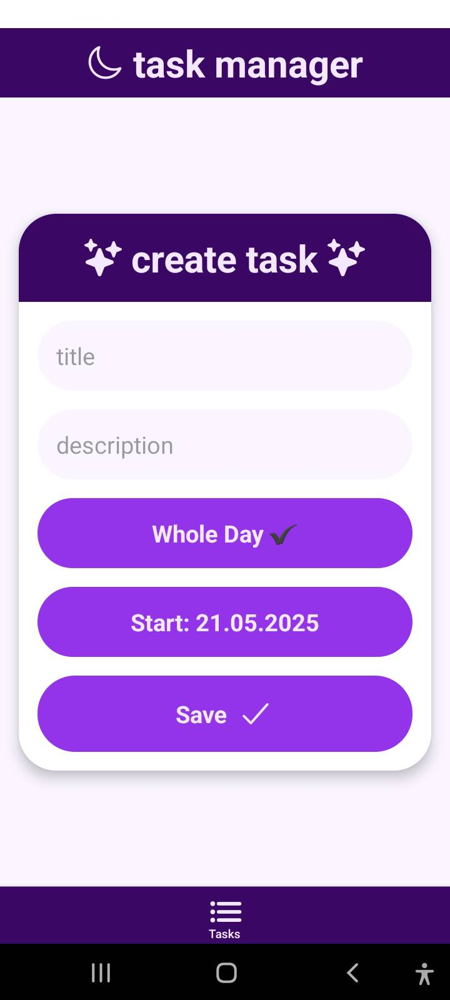
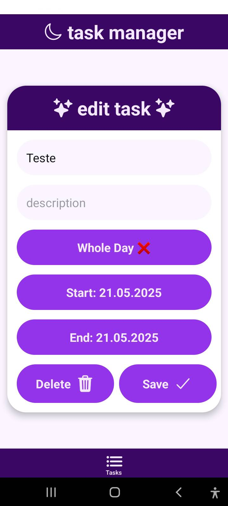
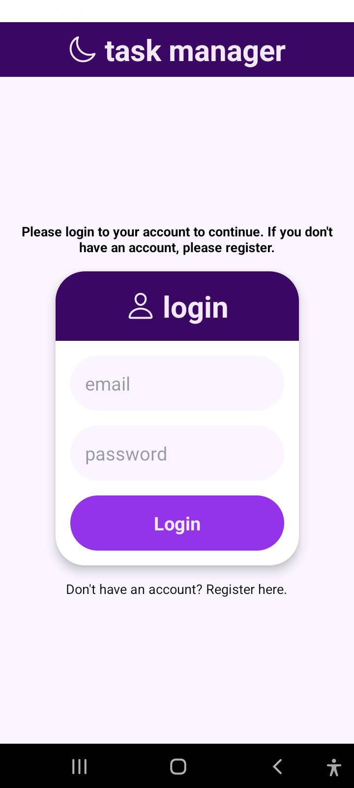
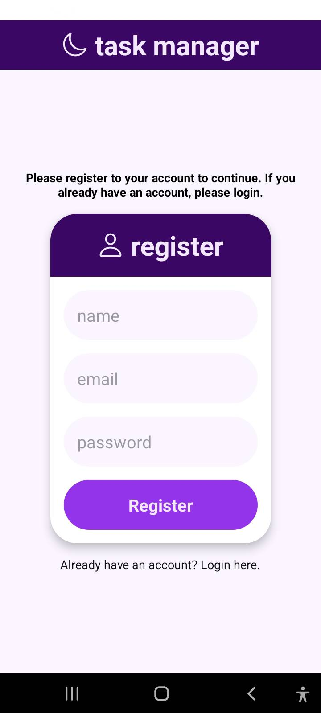

# Task manager

This application is a simple task manager that will use react-native for a mobile app, nest-js for back-end and maybe some nuxt (or next) for a web application.

This project was developed for educational purposes.

## Quick start

This project is a expo project, for more information about expo, check the [expo documentation](https://docs.expo.dev/).

```bash
# Clone the repo
git clone https://github.com/FaboBorgesLima/task-manager-react-native
```

```bash
# Go to the project directory
cd task-manager-react-native
```

```bash
# Install dependencies
npm install
```

```bash
# Start the application
npm start
```

From this point, you can use the expo app to scan the QR code that will be shown in your terminal.

You can also use the expo app to run the application in your android or ios device.

For creating a development build on Android, you can use the following command:

Obs: You need to have the JDK 17 installed for this command to work. And this command will take a while to run, so go take a coffee ☕ .

```bash
eas build -p android --profile development --local
```

## Goals

-   User can create his profile and/or log in.
-   User can have many tasks.
-   User can have recurring tasks during the week.
-   User can have tasks that can be concluded during the day and tasks that need to be concluded in a specific hour.

## Goals ideas

-   Integrate it with platforms like Github for things like "GitHub contribution metas".
-   Create some sort of gamification.

## Goals check-list

-   [x] Base project structure
    -   [x] Styles
    -   [x] Routes
-   [ ] User management
    -   [x] Create user
    -   [x] Login
    -   [ ] Profile
    -   [ ] Edit user name
    -   [ ] Logout
-   [ ] Task management
    -   [x] Create
    -   [x] Edit
    -   [ ] View daily tasks
    -   [ ] View tasks as calendar

## Updates since last check point

I used zustand for state management, so the application is more organized and easier to maintain.

I separated components like `Card`, `PressableCard`, `TaskCard` and `TaskForm` to make the code more modular and reusable.

[video](https://youtu.be/uCoLGUzustU)

## Screens prototype

[Wiki figma page](https://github.com/FaboBorgesLima/task-manager-nestjs/wiki/Screens-prototypes)

## Data modeling

[Entity relationship page](https://github.com/FaboBorgesLima/task-manager-nestjs/wiki/Data-modeling)

## Sprints chronogram

-   [x] Base project structure (2 week)
-   [ ] User management (4 week)
-   [ ] Task management (6 week)

Obs: If in the end there is too much "free time", i will create more sprints and goals.

## Screenshots







## Diference between unitary and e2e tests

Unitary tests are used to test a single unit of code, like a function or a class, in isolation. They are fast and help to ensure that the code works as expected.

E2E (end-to-end) tests, on the other hand, test the entire application flow, from start to finish, simulating real user scenarios. They are slower and more complex but help to ensure that all parts of the application work together as expected.
